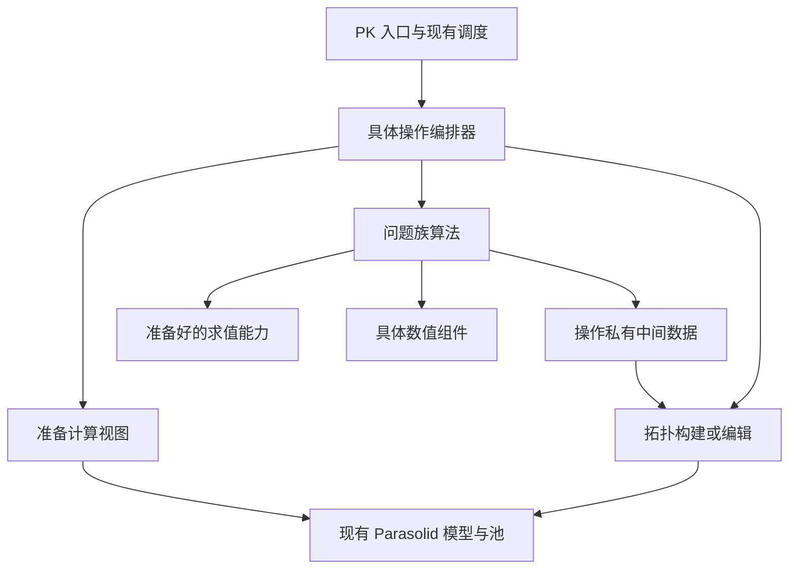

# 几何内核的算法工程框架

日期：2026-09-05。本文替代此前偏重 B-rep 概念说明的版本。

## 1. 目标与确定的前提

本项目的拓扑、几何、拥有关系、容差模型和公开 API 语义全部参考 Parasolid。这是架构的输入条件，不再讨论是否采用另一种内核的领域模型。OCCT 只用于具体算法和局部实现的参考。

需要建立的框架使一个新功能可以：

1. 在不启动完整 session、不构造整棵 body 的情况下独立开发计算部分。
2. 在后续算法中直接复用，不重复转换数据、不复制一套求解器。
3. 与其他步骤共享明确的中间数据和工作区，不共享隐藏的全局状态。
4. 将结果受控地交给拓扑构建和修改代码。
5. 在 AOT、内存、失败和调试方面保持一致的编程习惯。

建议采用 **静态函数分派 + 统一计算视图 + 操作私有中间数据 + 显式工作区**。框架规定代码怎样合作，不创建一个负责发现、调度、重试所有算法的通用引擎。

本文区分“已落地的公共基础”和“后续功能遵循的组织方式”。框架初版未实现几何公式；后续已接入首批解析求值 API，具体范围和验证见 `docs/geometry_evaluation.md`。数值求解器、求交、欧拉操作和布尔仍按下述组织方式逐步实现。

## 2. 已落地的代码

以下路径全部相对于项目根目录。

| 文件 | 作用 |
|---|---|
| `src/ProjectGmKernel.Native/Computation/AlgorithmStatus.cs` | 内部执行状态，不与 PK 错误码或几何分类混用 |
| `src/ProjectGmKernel.Native/Computation/WorkBuffer.cs` | caller-owned typed span 分配游标，不增长、不分配托管对象 |
| `src/ProjectGmKernel.Native/Geometry/Evaluation/SurfaceDerivativeLayout.cs` | 内部导数布局与索引，包含尺寸溢出检查 |
| `src/ProjectGmKernel.Native/Runtime/KernelTypes.cs` | 工作区偏移/计数和导数阶数的全局别名 |
| `tests/KernelTests/ComputationFrameworkTests.cs` | 可编译组合范例：静态调用、阶段传值、失败隔离、显式后备、工作区和分配检查 |

测试中的 ProbeSurface 只产生标记数据，用来验证阶段组合。生产求值现位于 `src/ProjectGmKernel.Native/Geometry/Evaluation/CurveEvaluation.cs`、`src/ProjectGmKernel.Native/Geometry/Evaluation/SurfaceEvaluation.cs`；API 适配位于 `src/ProjectGmKernel.Native/Runtime/KernelRuntime.Evaluation.cs`。

## 3. 四种代码角色

### 3.1 持久模型

实体池、tag、记录和 Parasolid 拥有关系继续属于 Runtime。API 调度遵循 `docs/API_Dispatch_Model.md`。

算法不能把 KernelRuntime 当服务定位器，在迭代中任意查询 session、申请实体或修改记录。只有输入准备、模型读取和最终应用修改的代码接触模型访问入口。

现有 KernelVector3 等小型数值记录仍可复用。不为了目录分层马上移动类型或拆程序集。

### 3.2 计算视图

例如 B-surface 求值器需要次数、结点、控制点、权重和参数处理策略。它不应每次 Evaluate 都通过 SurfTag 从全局池重新查这些数据。

准备步骤解析 tag 一次，检查支持能力，然后构造轻量、按操作使用的计算视图。它可以持有只读数组/内存区间描述，或者受控的 native 存储引用，不复制整个几何。借用存储时，操作期间不得释放或移动所借用的数据。

计算视图使用 struct 或需要借用 span 时的 ref struct，携带类型判别及稳定的数据引用，不包含虚方法或委托。只读数据按 in 传递，可变工作状态按 ref 显式传递；数据与执行函数分开。具体视图字段在实现首个真实求值器时按现有 Parasolid 数据确定，不提前创建没有数据的占位视图。

“上次求值的 knot span”属于操作局部加速信息，不应随手写入共享 Surface 记录。否则多个算法及未来并行调用会相互干扰。

### 3.3 计算算法

每个问题族是普通 C# 模块，例如曲线最近点、曲面求交、曲线逼近。它接收准备好的能力、具体 options、输出 span 和 workspace，返回状态及该问题自己的结果信息。

不要求继承 AlgorithmBase，不引入 Execute(object)、Result<object>、字符串算法名称或反射注册表。

### 3.4 建模操作

布尔、扫掠、倒角是显式编排器，决定阶段顺序、验证、补算/后备、拓扑构建及提交。

编排器直接调用具体静态函数。核心求值与算法路径默认不采用接口派发、委托注册或继承体系；策略选择写成显式类型/策略分支。



这是依赖边界，不是所有调用必须经过的流水线引擎。纯求值入口只需准备视图并调用求值器。

## 4. 一个新模块应当长什么样

以未来曲面最近点为例，不应写成一个同时处理 tag、迭代、候选、错误码的大方法：

| 角色 | 输入 | 输出 | 独立测试对象 |
|---|---|---|---|
| API 适配 | PK 参数/tag | 内部请求与 PK 返回 | 参数与错误映射 |
| 输入准备 | Surface 数据、请求 | 计算视图、有效范围 | 存储访问与生命周期 |
| 最近点算法 | 计算视图、目标、options、workspace | 候选与完成状态 | 假求值器、解析测试几何 |
| 数值组件 | 本问题的残差/Jacobian 能力 | 一次数值求解结果 | 纯数值函数 |
| 结果选择 | 候选与请求语义 | 选择后的结果 | 无需再次求值 |

抽象以“有独立调用者的职责”为界。只服务于最近点的 residual adapter 可以是该模块私有 struct；第二个问题真正出现后，再提取共享约定。

下面是未来问题族的示意路径，当前不创建空文件：

```text
src/ProjectGmKernel.Native/Geometry/Projection/SurfaceProjection.cs
src/ProjectGmKernel.Native/Geometry/Projection/SurfaceProjectionOptions.cs
src/ProjectGmKernel.Native/Geometry/Projection/ProjectionCandidate.cs
src/ProjectGmKernel.Native/Geometry/Projection/SurfaceDistanceFunction.cs
```

小问题族可以先放在一个文件中，不为目录格式强行拆分。

## 5. 静态求值入口与热路径调用

统一曲面计算视图只描述已准备的数据。解析曲面已通过 AnalyticSurface 接入以下静态调用形式（参数以具体实现为准）：

```csharp
SurfaceEvaluation.Evaluate(in surface, u, v, in layout, derivatives, workspace);
```

入口按曲面类型显式分派到具体静态函数，例如 PlaneEvaluation、BSurfaceEvaluation。反求、交线跟踪调用同一个入口，不依赖各类型的存储细节，也不需要携带泛型 provider 参数。

ICurveEvaluator 和 ISurfaceEvaluator 已移除，不用另一个接口或委托替代它们。生产分派分支随真实算法加入；现有解析类型已经实现，其余类型明确返回未实现。

`tests/KernelTests/ComputationFrameworkTests.cs` 中 ProbeSurface 是测试数据，ProbeSurfaceEvaluation 是独立的静态执行函数。PrepareCandidates 静态调用它，成功后由 RunPipeline 将中间数据交给 PublishCandidates。它验证阶段合作和内存机制，不声称验证了真实曲面类型分派。

求值、参数域、包围界、连续性分片可以是各自独立的静态模块，共享计算视图或专门输入数据，不集中到一个巨大对象中。测试从具体静态函数和准备好的数据入手，不为了注入假实现给生产代码加入动态派发。

静态分派仍可能包含运行时的类型 switch；这不等于接口虚调用，也不意味着所有分支都编译期消失。关键是调用目标有限、数据显式、没有装箱。若热点循环中已知具体类型，可直接调用对应静态函数；是否将 switch 移出循环由实际测量决定。

导数布局采用简单矩形内部数组：index = uOrder × (VOrder + 1) + vOrder，(0,0) 为位置。它不改变 Parasolid 参数化、handedness 或输出约定。PK 入口负责按契约提取/重排。若矩形布局使 D1/D2 热路径多算不需要的混合项，具体求值实现时增加专用快路径，不能为通用接口牺牲主要调用性能。

同样，不建立一个装入所有池、算法和缓存的全局 KernelContext。数值组件只接收函数与 options；几何算法接收 计算视图和 workspace；建模操作才需要模型读写能力。取消在编排器和长循环边界直接检查 CancellationToken。

## 6. 特殊算法、通用算法与分派

分派分为两个位置：问题入口选择策略，循环内部反复求值。

类型组合先用显式 switch 或静态路由。解析特殊对直接走具体函数；一般情形进入通用算法。不要为每种几何组合创建一个类，也不要把所有特殊解塞进通用求解器。

双曲面类型对在问题入口集中分派，通用算法接收两个统一计算视图。不让几何类型作为泛型参数沿调用链传播。热点特殊对可保留具体静态实现，避免为全部类型组合生成重复代码。

后备由问题族入口明确写出，公共框架不对所有失败自动重试。测试 RunWithFallback 仅对 Unsupported 启用后备，演示控制权的位置；未来某个求交器可以明确规定 NotConverged 改用细分，并管理预算与诊断。

重试创建新的逻辑结果或完整覆盖旧候选，不能把第一次失败的数据混进第二次成功结果。

## 7. 数值组件共享到什么程度

共享明确的计算部件：小型线性系统、根求解、线搜索、信赖域步骤、区间细分、基函数计算等。它们各有有限契约与测试。

不要从第一天建立覆盖任意维度、任意残差、任意迭代方式的万能求解框架。几何问题需要特殊步长限制、参数域处理和分支跟踪，过度统一会把差异变成大量 callbacks 和开关。

例如两参数投影先采用明确的 2 变量系统；交线预测校正保留自己的外层循环，复用线性系统与校正组件；样条基函数计算不依赖哪个 PK API 发起调用。

数值组件优先使用静态函数和明确的值类型输入。残差/Jacobian 的计算可由具体问题的静态模块负责，共享线性代数和迭代步骤；需要多策略时采用有限的显式分派。避免为“通用求解器”将 Func、闭包或接口对象带入逐点/迭代路径。问题族 options 不进入一个全局巨型结构。

## 8. 工作区、中间结果与缓存

### 8.1 生命周期

| 数据 | 谁拥有 | 有效期 | 下游能否保留 |
|---|---|---|---|
| 持久模型 | Runtime | 实体/session 生命周期 | 按模型访问契约 |
| 计算视图 | 当前操作 | 借用数据稳定期间 | 不跨未受控修改 |
| scratch | 当前调用者 | 本次调用，下次可覆盖 | 不允许 |
| intermediate | 操作编排器 | 所有依赖阶段完成前 | 同次操作内允许 |
| API output | 返回内存桥 | PK 生命周期 | 按外部契约 |

WorkBuffer 只在已有 Span 上划分不重叠片段，不清零、不扩容、不释放模型内存，不是新实体池。T 限制为 unmanaged，避免隐藏托管对象图。

算法可在自己的 scratch span 上创建本地 WorkBuffer。多次调用复用同一 scratch，前提是没有结果引用它。需要保留的候选和交线数据放在独立 intermediate 存储。

WorkBuffer 是 ref struct 值类型；共享游标必须按 ref 传递，复制会产生可能重叠分配的两个游标。当前不提供 rewind/mark，以免提前引入结果失效问题。整个调用结束后以相同存储创建新游标即可复用。

### 8.2 容量

固定规模求值使用 caller-owned span。规模未知的求交在具体问题族定义需求估计、增长块或重试规则，公共 WorkBuffer 不隐式增长。

当前可返回 WorkspaceTooSmall，但没有通用容量估计接口。将来样条数据的准备步骤可以提供阶数相关的需求，不靠迭代中的反复失败猜容量。OutputTooSmall 与 scratch 不足分开。

普通输出使用 span + 有效数量，不能扫描零值判断结束。所有算法都要写清是否支持输入输出重叠；求值入口约定不重叠。

### 8.3 缓存

先做操作内部缓存，如 knot span、包围界、已处理实体对。确实需要跨操作复用后，再增加按模型版本失效的缓存。

缓存不进入几何定义，不改变 Parasolid 所有权，不将算法运行状态挂到共享实体上。首版粗粒度失效优于未经验证的复杂增量维护。

## 9. 阶段之间传什么

每个问题族定义结果记录，公共层只共享执行状态。不要创建包含几十个可空字段的万能 AlgorithmResult。

未来求交结果记录事件、分支、参数对应、误差及存储片段。字段由首个实际能力决定，本次不创建假想的全量 IntersectionGraph。中间实体使用局部索引及对应全局别名，不能提前分配正式 PK tag。

简单结果采用 Span + 有效数量；复杂结果用具体只读视图组合多个 ReadOnlySpan，所有者仍是编排器。不要为传参方便转成 List 或每阶段复制数组。

阶段输入保持只读；补算阶段有明确输出区。真正的原位算法显式声明复用，不让一组函数随意修改全局字典。

## 10. 状态、完成度与诊断

AlgorithmStatus 只回答调用是否完成其契约。仅 Success 时输出有效；失败可能已经写入部分数据，调用者不能消费。默认 NotRun 防止未初始化结果被当作成功。

成功无交可表示为 Success + 0；未找全交线不能这样返回。需要部分完成时，由具体问题族增加完成报告和未解析区域，不把公共状态退化为 bool。

几何分类属于结果，PK 错误码属于 API 边界。具体 API 根据内部状态与问题报告转换，不提供脱离 API 语义的全局一对一错误映射。

诊断用问题族的紧凑记录表达阶段、实体、参数、迭代数和残差，报告时才格式化字符串。编程契约错误可以抛异常，例如非法导数布局；API 适配先验证外部输入。正常数值失败走状态。

## 11. 拓扑编辑如何参与

以下只讨论代码组织，不重新定义 Parasolid 拓扑。

建议两条写路径：局部编辑用于已有体的拆边、分环和局部替换；批量构建用于拉伸新体、布尔新结果。它们共享基本链接维护与验证，但批量构建不必模拟长串公开 Euler API，局部编辑也不必重建整个体。

内部函数直接调用内部 editor，不通过公开 PK 入口绕回调度。公开 Euler API 是相应内部能力的适配。

```text
准备受影响实体
  → 计算必要几何与参数
  → 建立本次编辑范围
  → 调用具体拓扑编辑原语
  → 附着计算结果
  → 检查受影响区域
  → 发布/失败恢复
```

构建器/editor 内部集中维护连接。求解器禁止直接写 Fin/Edge/Face 池。当前旧代码未被迁移或封装，这是一条新功能边界，不假装已有编译期写权限隔离。

第一次实现编辑时，必须同时处理旧记录恢复、分配/释放及 tag 生命周期。现有 Mark 不足以承担这项职责。本次不创建一个空 ITransaction 冒充事务实现；editor 必须通过真实修改与故障注入后才能启用。纯计算模块可以在这之前独立完成。

## 12. 四个接入案例

### 曲面求值

先实现具体类型的静态求值函数，独立测试数学结果、布局、容量和分配；再准备统一计算视图并将该类型接入静态分派；最后 PK 入口验证参数、调用并转换输出。

后续算法直接复用静态求值入口，不调用 PK 层，计算单元测试无需全部启动 session。

### 曲面反求

接收计算视图，把本问题组织成数值系统，复用小型求解组件。初值与候选策略留在反求模块，不放入 Surface 实体。有解析特殊解时由入口优先选择。

### 曲面求交

入口选择类型对策略；模块产生操作私有事件/交线；边界裁剪模块消费结果；需要压印或布尔时才进入拓扑构建。求交可独立调试，切面也可用人工构造的中间数据测试。

### 布尔

编排器持有候选对、干涉、分割和分类结果，顺序调用：

```text
PrepareInputs
FindCandidatePairs
ComputeInterferences
SplitBoundaries
ClassifyFragments
SelectResult
BuildTopology
ValidateAndPublish
```

这是未来职责名称，不是预生成接口。阶段通过本问题族的类型化数组/视图传值；Section/Split 可复用干涉数据，不需要继承 BooleanOperation。

OCCT 相交数据与构建阶段分离，可以作为这个局部工程决定的参考；不采用其拓扑或几何模型。[OCCT Boolean Operations](https://occt3d.com/dev/doc/overview/html/specification__boolean_operations.html)

## 13. 目录与新增抽象的时机

以下包括未创建的计划目录：

| 目录 | 内容 |
|---|---|
| `src/ProjectGmKernel.Native/Computation/` | 少量公共编程设施 |
| `src/ProjectGmKernel.Native/Numerics/` | 不依赖模型的数值组件 |
| `src/ProjectGmKernel.Native/Geometry/Evaluation/` | 静态求值入口与具体实现 |
| `src/ProjectGmKernel.Native/Geometry/Projection/` | 投影问题族 |
| `src/ProjectGmKernel.Native/Geometry/Intersection/` | 求交问题族 |
| `src/ProjectGmKernel.Native/Brep/` | 使用 Parasolid 模型的裁剪、分类与附着协调 |
| `src/ProjectGmKernel.Native/Topology/` | 局部编辑与批量构建 |
| `src/ProjectGmKernel.Native/Modeling/` | 建模操作编排 |
| `src/ProjectGmKernel.Native/Runtime/` | 现有 session、模型与存储 |

目前只创建有实际契约和测试的目录。先在一个程序集内固定依赖纪律；多人开发经常越界时，再通过程序集或架构测试加强限制。

新增抽象前检查：是否已有不同实现或调用者？是否稳定隔离了存储、生命周期或策略？不用是否会产生明显重复？没有明确答案就用普通函数。

## 14. 取舍

| 决策 | 收益 | 代价与边界 |
|---|---|---|
| 统一视图＋静态分派 | 无接口装箱、依赖明确、不传播 provider 泛型 | 需要集中维护分支，不能自动获得内联或消除 switch |
| caller-owned spans | 容量与生命周期清楚，可复用 | 调用者规划容量，遵守借用和不重叠契约 |
| 操作私有中间数据 | 阶段可独立测试与复用 | 需设计具体记录，可能增加峰值内存 |
| 显式编排与后备 | 易单步调试，允许问题特有策略 | 不自动提供 DAG 调度或通用重试 |
| 按问题组织静态模块 | 依赖面小、具体功能独立 | 用数据驱动测试，不能依赖接口注入替换全部实现 |
| 现有模型外加视图 | 保留 Parasolid 模型，减少反复解析 | 管理借用稳定性和缓存版本 |
| 编辑与计算分开 | 计算先行，发布受控 | editor/事务须实际实现，接口声明不带来正确性 |

它使每项新功能有明确接入位置，同时保留普通 C# 函数组合方式，不要求先搭一个庞大的算法平台。

## 15. 核心模块的分配纪律

- 数据优先值类型、池和 arena；只读大结构用 in，可变工作状态用 ref。
- 结果与 scratch 由调用者提供 Span，热点不使用临时数组、LINQ、闭包或逐项字符串格式化。
- 不将值类型转换为 object 或接口，不通过非泛型集合存储几何数据。
- 保留 WorkBuffer<T> 这类类型化容器泛型；少装箱不意味着禁止所有泛型。
- 不因声明 static 就认定零分配。预热后用分配计数测试实际调用链，并单独测量时间与工作区峰值。
- 扩容和诊断允许在明确冷路径发生，不能把“零 GC 分配”当作“无需内存管理”。

## 16. 验证边界

组合测试验证工作区不重叠与失败游标、导数索引溢出、静态调用、阶段传值、部分失败不发布、显式后备、取消、容量、空成功，以及预热后重复组合调用的零托管分配。

这些不证明任何几何算法、真实拓扑事务或 NativeAOT 数值性能。真实功能仍需数学/结构测试；涉及 Parasolid 兼容行为的修改继续按 AGENTS.md 增加真实 oracle。

框架初版验证结果：KernelTests 共 108 项通过（原有 98 项、新增 10 项）；Native 项目的 Release/linux-x64 NativeAOT 发布成功。组合测试在 .NET 测试宿主运行；发布检查不代表测试用静态组合已经在 AOT 产物中实际运行。临时发布产物位于 `temp_docs/computation-framework-aot/`。后续解析求值及 XT 回归的最新验证见 `docs/geometry_evaluation.md`。

本次完成边界是公共契约可编译、组合范例可运行、模块依赖和接入路径明确。后续功能按第 12 节接入并检验窄契约是否够用，不为“框架完整”提前补空求值器、空求交器或成功占位实现。
